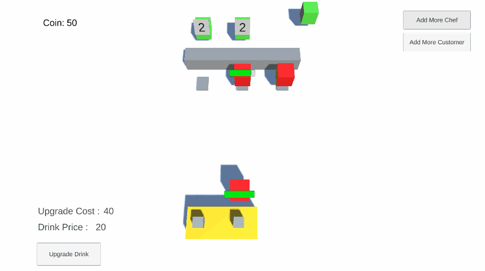

This is a simple Unity project that uses [Entitas](https://github.com/sschmid/Entitas) library and [ECS architecture](https://en.wikipedia.org/wiki/Entity_component_system) to implement a mobile kitchen game

### Unity Version And Libraries
* Unity version 2022.3.18f1 LTS
* Entitas version 1.13.0 (generated files are included here: Assets/Scripts/Generated)
* UniRx & DoTween

If you encounter errors when opening the project, probably the problem will be solved by re-installing TextMeshPro and Unity UI from the package manager.

### How it works?
* Open the main scene (Assets/Scenes/MainScene.unity), and play the game.
* After playing the game, you see that customers automatically come and wait to receive their order. (receiving the order is based on a queue, first-come first-in)
* The closest free chef goes to take the order from the customer.
* If there's more than one chef, and there's no free kitchen, the other chefs wait until there's a free kitchen.
* After delivering each order, you'll get some coins.
* When coins reach a specific amount, a drink upgrade button will be displayed at the bottom-left corner. (you can find upgrade data info here: Assets/Data/DrinkCoinLevelsPrice.asset)
* After the upgrade, the price of a drink increases based on the data in the scriptable object data.
* When coins reach a specific amount, a restaurant upgrade button will be displayed at the bottom-right corner. (you can find upgrade data info here: Assets/Data/Assets/Data/RestaurantLevelsCost.asset)
* After the upgrade, a new restaurant prefab will be loaded immediately (based on the data in the scriptable object data) which probably has more spots and more equipment. (it's flexible, so designers can change it as they wish)
* If you click on "Add more chef", a new chef will be spawned at the center. (you cannot spawn chefs more than restaurant capacity)
* If you click on "Add more customers", a new customer will be spawned. (you cannot spawn chefs more than restaurant capacity, you should wait until there's a free spot)

 

